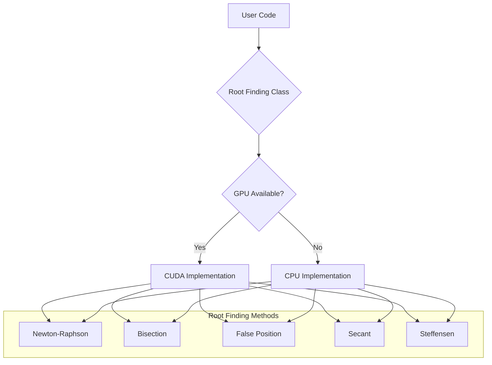

# Numerical Methods Root Finding

A C++/CUDA implementation of various root-finding algorithms that automatically switches between CPU and GPU implementations based on hardware availability.

## Architecture



## Features

- Multiple root-finding algorithms:
  - Newton-Raphson Method
  - Bisection Method
  - False Position Method
  - Secant Method
  - Steffensen Method
- Automatic GPU/CPU detection
- CUDA support for NVIDIA GPUs
- Fallback to CPU implementation when GPU is not available
- Configurable tolerance and maximum iterations

## Installation

### Prerequisites

- CMake (version 3.20 or higher)
- C++17 compatible compiler
- For CUDA support:
  - NVIDIA GPU
  - CUDA Toolkit (version 11.0 or higher)
  - NVIDIA drivers

### CPU-only Installation

1. Clone the repository:
```bash
git clone https://github.com/yourusername/numerical-methods.git
cd numerical-methods
```

2. Create and enter build directory:
```bash
mkdir build
cd build
```

3. Configure and build:
```bash
cmake ..
make
```

### CUDA Installation

1. Install CUDA Toolkit:
   - Windows: Download and install from [NVIDIA CUDA Toolkit](https://developer.nvidia.com/cuda-downloads)
   - Linux: 
     ```bash
     sudo apt update
     sudo apt install nvidia-cuda-toolkit
     ```

2. Clone and build:
```bash
git clone https://github.com/yourusername/numerical-methods.git
cd numerical-methods
mkdir build
cd build
cmake ..
make
```

The build system will automatically detect NVIDIA GPU availability and build the appropriate version.

## Usage

```cpp
#include "includes/RootFinding.hpp"

// Define your function and its derivative
double f(double x) {
    return x * x - 2;  // Example: finding square root of 2
}

double f_prime(double x) {
    return 2 * x;
}

int main() {
    // Create root finder with tolerance 0.00001 and max 100 iterations
    RootFinding root_finding(0.00001, 100, RootFindingMethod::NewtonRaphson);
    
    // Find root using Newton-Raphson method
    double root = root_finding.find_root_newton(f, f_prime, 1.0);
    
    return 0;
}
```

## Building from Source

### CPU Version
```bash
mkdir build
cd build
cmake ..
make
```

### CUDA Version
```bash
mkdir build
cd build
cmake ..
make
```

The build system will automatically detect NVIDIA GPU availability and build the appropriate version.

## Cleaning Build Files

To clean all build files:
```bash
cmake --build . --target clean_all
```

## License

This project is licensed under the MIT License - see the LICENSE file for details. 